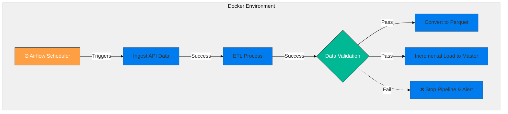

*A production-ready Data Engineering portfolio demonstrating end-to-end pipeline automation using Apache Airflow and Docker.*

---

## 📋 Overview

**Branch ini (`feature/airflow-integration`) adalah versi ADVANCED dari project ini.**

Berbeda dengan versi basic (manual execution), versi ini mensimulasikan lingkungan **Production** yang sebenarnya. Pipeline tidak lagi dijalankan satu per satu secara manual, melainkan diorkestrasi oleh **Apache Airflow** yang berjalan di dalam **Docker Containers**.

Project ini menjawab tantangan: *"Bagaimana cara membuat pipeline data yang otomatis, terjadwal, dan dependency-aware?"*

---

## 🛠️ Tech Stack (The Modern Stack)

Upgrade teknologi yang digunakan di branch ini:


---

## 🔄 Orchestrated Architecture

Seluruh alur kerja sekarang diatur oleh **DAG (Directed Acyclic Graph)** di Airflow untuk memastikan urutan eksekusi yang valid.


```mermaid
%%{init: {'theme': 'base', 'themeVariables': { 'primaryColor': '#017CEE', 'edgeLabelBackground':'#ffffff', 'tertiaryColor': '#F0F0F0'}}}%%
graph TD
    subgraph Docker Environment
        S[⏰ Airflow Scheduler] -->|Triggers| T1
        
        T1[Ingest API Data] -->|Success| T2[ETL Process]
        T2 -->|Success| T3{Data Validation}
        
        T3 -->|Pass| T4[Convert to Parquet]
        T3 -->|Pass| T5[Incremental Load to Master]
        
        T3 -.->|Fail| F[❌ Stop Pipeline & Alert]
    end
    
    style S fill:#ff9f43,stroke:#333,color:#fff
    style T3 fill:#00b894,stroke:#333,color:#fff
```

---

## 📂 Project Structure

Struktur folder telah direstrukturisasi agar kompatibel dengan Docker Volume Mapping:

```text
├── dags/                  # Instruksi kerja untuk Airflow (DAG files)
│   └── crypto_pipeline_dag.py
├── scripts/               # Logika Python (Modular)
│   ├── 01_simple_etl/
│   ├── ...
│   └── data/              # Folder penyimpanan output (Mapped Volume)
├── docker-compose.yaml    # Definisi infrastruktur (Airflow + Postgres)
├── Dockerfile             # Custom Image (Python Dependencies)
└── requirements.txt       # Library Python
```

---

## 🚀 How to Run (Docker Way)

Anda tidak perlu menginstall Python atau Library apa pun di laptop Anda. Cukup pastikan **Docker Desktop** sudah terinstall.

### 1. Clone & Switch Branch
```bash
git clone [https://github.com/trishagarniss/data-engineering-essentials.git](https://github.com/trishagarniss/data-engineering-essentials.git)
cd data-engineering-essentials
git checkout feature/airflow-integration
```

--- 

