*A practical portfolio demonstrating core Data Engineering concepts: Real-time API Ingestion, ETL Processes, Storage Optimization (Parquet), Data Quality Gates, and Incremental Loading strategies.*

---

## 📋 Overview

Repository ini bukan sekadar kumpulan script Python. Ini adalah simulasi **Data Pipeline** dunia nyata yang dirancang untuk menangani data pasar Cryptocurrency secara *real-time*.

Tujuan utama project ini adalah mendemonstrasikan kemampuan membangun infrastruktur data yang **reliable (dapat diandalkan), scalable (mudah diperbesar), dan maintainable (mudah dirawat)**, meniru tantangan yang dihadapi Data Engineer di industri setiap hari.

## 🛠️ Tech Stack

Data engineering is about choosing the right tools for the job.


---

## 🔄 The Pipeline Architecture

Visualisasi alur data dari sumber mentah hingga menjadi data historis siap pakai.

```mermaid
%%{init: {'theme': 'base', 'themeVariables': { 'primaryColor': '#3776AB', 'edgeLabelBackground':'#ffffff', 'tertiaryColor': '#F0F0F0'}}}%%
graph TD
    A[🌐 Internet/API Real-time] -->|Extract JSON| B(04_api_ingestion);
    B -->|Raw CSV| C{01_simple_etl};
    C -->|Transform & Enrich| D[Cleaned Data CSV];
    D -->|Quality Check| E{03_data_validation};
    E -- "✅ Valid Rows" --> F[Valid Data CSV];
    E -- "🚫 Invalid Rows" --> G[Quarantine / Error Log];
    F -->|Compression| H(02_csv_to_parquet);
    F -->|Append Mode| I(05_incremental_load);
    H --> J[📦 Optimized Storage .parquet];
    I --> K[🗃️ Master History DB .csv];

    style A fill:#f9f,stroke:#333,stroke-width:2px,color:#000
    style K fill:#bbf,stroke:#333,stroke-width:2px,color:#000
    style J fill:#d4edda,stroke:#28a745,stroke-width:2px,color:#000
```



---

## 📂 Project Breakdown (The Journey)

Berikut adalah rincian modul berdasarkan alur eksekusi pipeline:

### 1️⃣ 🌐 Ingestion: Real-time API Data (Project 04)
**Objective:** Mengambil data pasar crypto live dari sumber eksternal (CoinGecko/Indodax API).
* **Key Skill:** Menangani HTTP Requests, parsing nested JSON complex menjadi format tabular datar, dan menambahkan *ingestion timestamps* untuk audit trail.
* *Why it matters:* Menunjukkan kemampuan berinteraksi dengan sistem eksternal dan menangani data yang dinamis.

### 2️⃣ 🔄 ETL & Business Logic Transformation (Project 01)
**Objective:** Mengubah data mentah API menjadi format yang siap dianalisis bisnis.
* **Key Skill:** Pandas dataframe manipulation. Melakukan filtering (Top 50 coins), konversi mata uang (USD ke IDR), dan membuat kolom kategori baru berdasarkan logika bisnis.
* *Why it matters:* Data Engineer harus mengerti kebutuhan bisnis dan menerjemahkannya menjadi transformasi data yang efisien.

### 3️⃣ 🛡️ Quality Gate: Data Validation (Project 03)
**Objective:** Bertindak sebagai "polisi data" sebelum data masuk ke storage utama.
* **Key Skill:** Menerapkan *defensive programming*. Memisahkan data yang valid (bersih) dengan data yang invalid (misal: harga negatif, nama kosong) ke dalam file terpisah untuk investigasi.
* *Why it matters:* Mencegah "Garbage In, Garbage Out". Menjamin kepercayaan stakeholders terhadap data di dashboard.

### 4️⃣ 📦 Storage Optimization: Parquet (Project 02)
**Objective:** Efisiensi penyimpanan untuk skala Big Data.
* **Key Skill:** Mengonversi data dari format baris (CSV) ke format kolom (Parquet). Script ini menyertakan laporan kompresi untuk membuktikan penghematan storage (seringkali >60%).
* *Why it matters:* Di skala TB/PB, format file sangat mempengaruhi biaya cloud storage dan kecepatan query.

### 5️⃣ ⏳ Architecture: Incremental Loading (Project 05)
**Objective:** Membangun database historis tanpa menimpa data lama.
* **Key Skill:** Menerapkan strategi *Append-Only*. Script secara cerdas mendeteksi apakah master data sudah ada; jika ya, data baru ditambahkan di bawahnya untuk membentuk histori harga dari waktu ke waktu.
* *Why it matters:* Fundamental untuk membangun Data Warehouse di mana histori data sangat krusial untuk analisis tren.

---

## 🚀 How to Run This Pipeline

Simulasikan alur kerja ini di mesin lokal Anda:

**1. Clone & Setup Environment**
```bash
git clone https://github.com/trishagarniss/data-engineering-essentials.git
cd data-engineering-essentials
# Buat virtual environment (rekomendasi)
python -m venv venv
# Aktifkan venv (Windows: .\venv\Scripts\activate | Mac/Linux: source venv/bin/activate)
pip install -r requirements.txt
```

**2. Execute the Pipeline Steps (In Order)**
```bash
# Step 1: Tarik data terbaru dari internet
python 04_api_ingestion/fetch_crypto_data.py

# Step 2: Olah dan peraya datanya
python 01_simple_etl/etl_script.py

# Step 3: Validasi kualitasnya
python 03_data_validation/validate_data.py

# Step 4 (Optional): Buat versi Parquet yang optimal
python 02_csv_to_parquet/parquet_converter.py

# Step 5: Masukkan ke Master History (Jalankan beberapa kali untuk lihat efeknya)
python 05_incremental_load/update_master.py
```
*Cek folder `/data` setelah menjalankan setiap langkah untuk melihat transformasinya.*

---

## ✨ Key Takeaways

Repo ini mendemonstrasikan pemahaman saya bahwa Data Engineering bukan hanya tentang menulis kode Python, tetapi tentang:
* Memastikan **kualitas dan integritas** data.
* Memikirkan **efisiensi penyimpanan** dan biaya.
* Membangun sistem yang **tahan banting** terhadap perubahan data eksternal.
* Memahami **kebutuhan bisnis** dalam transformasi data.

---
<div align="center">
  <sub>Built with 💙 and lots of coffee by Trisha Garnis</sub>
</div>
